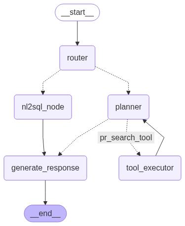

# R2-Dev2: Backend

This repository contains the backend service for the AI Developer Productivity Assistant. It's a FastAPI application designed to provide a conversational AI interface for developers, with tools for searching documents, interacting with Jira tickets, summarizing pull requests, and more.

## Table of Contents

- [Features](#features)
- [Tech Stack](#tech-stack)
- [Project Structure](#project-structure)
- [Getting Started](#getting-started)
  - [Prerequisites](#prerequisites)
  - [Installation](#installation)
  - [Environment Configuration](#environment-configuration)
- [Running the Application](#running-the-application)
- [API Endpoints](#api-endpoints)
  - [Authentication](#authentication)
  - [Chat](#chat)
  - [Data Retrieval](#data-retrieval)
  - [Recommendations](#recommendations)
- [Core Components and Notes](#core-components-and-notes)
  - [Chat Agent (LangGraph)](#chat-agent-langgraph)
  - [NL2SQL (Natural Language to SQL)](#nl2sql-natural-language-to-sql)
  - [RAG with PGVector](#rag-with-pgvector)
  - [LLM Observability (LangSmith)](#llm-observability-langsmith)
  - [Basic Authentication](#basic-authentication)
  - [Database Schema](#database-schema)
- [Scripts](#scripts)
- [Deployment](#deployment)

## Features

- **Conversational AI Agent:** A sophisticated agent built with LangGraph that can understand user queries and route them to the appropriate tool.
- **Natural Language to SQL (NL2SQL):** Allows users to query the database using natural language (e.g., "what are my open tickets?").
- **Tool Integration:** The agent can use a variety of tools to perform actions like:
  - Searching technical documentation.
  - Retrieving Jira ticket information.
  - Summarizing pull request diffs.
  - Searching for learning resources.
- **Session Management:** Conversation history is maintained across requests.
- **Recommendations:** An AI-powered recommendation engine suggests follow-up actions based on the conversation.
- **Dockerized:** The service is fully containerized for easy deployment.

## Tech Stack

- Python 3.13
- FastAPI
- LangChain & LangGraph
- PostgreSQL with PGVector
- Pipenv
- Docker
- LangSmith (for LLM Observability)

## Project Structure

A brief overview of the key directories:

```
backend/
├── artifacts/                        # Output for generated files like visualizations
├── configs/                          # Configuration files, including .env files
├── data/                             # Data for mock data population
├── scripts/                          # Helper scripts for populating DB, embedding docs
├── src/
│   ├── apis/
│   │   ├── deps/                     # Dependencies for routes (e.g., authentication)
│   │   └── routes/                   # FastAPI routers for different API endpoints
│   ├── services/
│   │   ├── agent/                    # LangGraph agent definition and tools
│   │   ├── database_manager/         # Database connection and operations
│   │   ├── doc_search/               # Document search services
│   │   ├── embedding_engine/         # Text embedding generation
│   │   ├── pr_summarizer/            # PR summarization logic
│   │   ├── recommendation_engine/    # Recommendation service
│   │   └── vector_search/            # Vector similarity search
│   └── utils/                        # Utility functions like logging
├── Dockerfile                        # Docker configuration
├── main.py                           # FastAPI application entry point
└── Pipfile                           # Project dependencies
```

## Getting Started

### Prerequisites

- Python 3.13
- Pipenv
- Docker (optional, for containerized deployment)

### Installation

1.  **Clone the repository:**
    ```bash
    git clone <repository-url>
    cd backend
    ```

2.  **Install dependencies:**
    Pipenv will automatically create a virtual environment and install the dependencies specified in the `Pipfile`.
    ```bash
    pipenv install
    ```

3.  **Activate the virtual environment:**
    ```bash
    pipenv shell
    ```

### Environment Configuration

The application requires several environment variables to be set. Create a `.env` file in the `configs/secrets/` directory (`configs/secrets/.env`). You can use `configs/secrets/.env.example` if it exists, or create the file from scratch.

```env
# PostgreSQL Database Connection
PG_HOST=localhost
PG_PORT=5432
PG_USER=your_db_user
PG_PASSWORD=your_db_password
PG_DB=your_db_name

# OpenAI API Key
OPENAI_API_KEY=your_openai_api_key

# LangSmith LLM Observability
LANGCHAIN_TRACING_V2=true
LANGCHAIN_ENDPOINT="https://api.smith.langchain.com"
LANGCHAIN_API_KEY=your_langchain_api_key
LANGCHAIN_PROJECT=your_project_name

# Basic Authentication Credentials for protected endpoints
BASIC_AUTH_USER=your_username
BASIC_AUTH_PASS=your_password

# Logging Configuration
LOG_DIRECTORY=logs
LOG_NAME=backend_app.log
LOG_LEVEL=INFO
LOG_MAX_BYTES=10000000
```

## Running the Application

To run the application locally using Uvicorn:

```bash
uvicorn main:app --host 0.0.0.0 --port 8000 --reload
```

The API will be available at `http://localhost:8000`. The `--reload` flag enables hot-reloading for development.

## API Endpoints

The API is structured into several routers.

### Authentication

-   **`POST /auth/login`**: Authenticates a user with email and password.
-   **`GET /auth/users`**: Retrieves a list of all users.

### Chat

-   **`POST /chat/agent`**: (Protected) The main endpoint to interact with the chat agent. It handles session creation and stores conversation history.
-   **`GET /chat/sessions/{user_id}`**: Retrieves all chat sessions for a user.
-   **`GET /chat/sessions/{user_id}/last-active`**: Retrieves the last active session for a user.
-   **`GET /chat/sessions/{session_id}/messages`**: Retrieves all messages for a given session.
-   **`PUT /chat/sessions/{session_id}/rename`**: Renames a chat session.
-   **`DELETE /chat/sessions/{session_id}`**: (Protected) Deletes a chat session.

### Data Retrieval

This set of endpoints is used to fetch data from the database.

-   **`/data/users/{user_id}/tickets`**: Get tickets for a user, with status filters (`/open`, `/closed`, `/in-progress`).
-   **`/data/tickets/{ticket_id}/pull-requests`**: Get pull requests for a ticket.
-   **`/data/pull-requests/{pr_id}/diff`**: Get the git diff for a PR, with an AI-generated summary.
-   **`/data/docs`**: Fetch documents, with filters for project or specific doc ID.
-   **`/data/learning`**: Fetch learning resources, with search and filtering capabilities.
-   **`/data/users/{user_id}/info`**: Get detailed user information.

### Recommendations

-   **`POST /recommendations`**: (Protected) Generate 2-3 follow-up action recommendations based on the recent messages in a chat session.

## Core Components and Notes

### Chat Agent (LangGraph)

The core of the service is the `ChatAgent`, a conversational agent built using [LangGraph](https://python.langchain.com/docs/langgraph/). It operates based on a state machine (a `StateGraph`) that orchestrates the flow of a conversation.

When a user query is received, the agent first determines if it's a question that can be answered by querying the database (NL2SQL) or if it requires a general-purpose tool. Based on this classification, it routes the query to the appropriate service. The agent maintains the conversation state, including message history, which allows for contextual follow-up questions.

A visualization of the agent's graph is generated upon application startup and can be seen below. This graph illustrates the flow of logic within the agent.



### NL2SQL (Natural Language to SQL)

The NL2SQL service allows the agent to answer questions about data stored in the PostgreSQL database using natural language. For example, a user can ask "How many open bugs are assigned to me?" and the service will:
1.  Convert the natural language question into a SQL query.
2.  Execute the query against the database.
3.  Return the results to the LLM, which then formulates a natural language response for the user.

This is powered by LangChain's NL2SQL capabilities and is integrated as a node in the `ChatAgent`'s graph.

### RAG with PGVector

Our application implements a Retrieval-Augmented Generation (RAG) pipeline to provide context-aware responses. We generate vector embeddings for our technical documentation and learning resources using OpenAI's `text-embedding-3-small` model. These embeddings are stored and indexed in a PostgreSQL database using the [PGVector](https://github.com/pgvector/pgvector) extension.

PGVector allows for efficient nearest-neighbor searches, enabling the agent to quickly find the most relevant document chunks for a given user query. This retrieved context is then passed to the LLM to generate a more accurate and informative response.

### LLM Observability (LangSmith)

We use [LangSmith](https://smith.langchain.com/) for LLM observability and tracing. This allows us to monitor, debug, and evaluate the performance of our LangGraph agent and other LLM-powered components in real-time. To enable LangSmith, you'll need to configure the corresponding environment variables shown in the [Environment Configuration](#environment-configuration) section.

### Basic Authentication

Several endpoints that perform sensitive operations or are user-specific are protected with HTTP Basic Authentication. The username and password must be provided in the request headers. These credentials are set via the `BASIC_AUTH_USER` and `BASIC_AUTH_PASS` environment variables. The application uses `secrets.compare_digest` for a secure, constant-time comparison of credentials.

### Database Schema

The application uses a PostgreSQL database. The schema is composed of the following tables:

-   **`users`**: Stores user information, including credentials and roles.
-   **`projects`**: A simple table for project details.
-   **`jira_tickets`**: Contains information about Jira tickets.
-   **`pull_requests`**: Stores PR details, linked to tickets and users.
-   **`git_diffs`**: Caches the text of git diffs for PRs.
-   **`documents`**: For storing technical documentation content.
-   **`learnings`**: Stores learning resources with tags and URLs.
-   **`chat_sessions`**: Manages individual chat conversations.
-   **`chat_messages`**: Stores the history of messages within each session.

## Scripts

The `scripts/` directory contains several useful Python scripts for managing the application's data:

-   **`populate_mock_data.py`**: Populates the database with mock data for users, tickets, etc. into the database tables.
-   **`embed_docs.py`**: Reads documents, generates embeddings for them, and stores them for semantic search.
-   **`embed_learning.py`**: Does the same for learning resources.
-   **`elaborate_docs.py`**: Uses an LLM to elaborate on or expand existing documentation.

## Deployment

The included `Dockerfile` allows you to build and run the service in a container.

1.  **Build the Docker image:**
    ```bash
    docker build -t r2-dev2-backend .
    ```

2.  **Run the Docker container:**
    You'll need to pass the environment variables to the container. The easiest way is with an `--env-file`.
    ```bash
    docker run -d -p 8000:8000 --env-file configs/secrets/.env --name r2-dev2-backend r2-dev2-backend
    ```
    The service will be accessible at `http://localhost:8000`. 