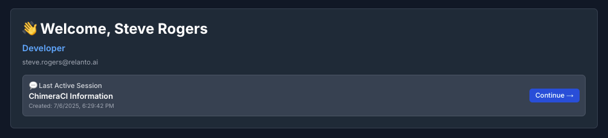

# R2-Dev2: Frontend

This is the frontend for the R2-Dev2 application, a modern web application built with Next.js. It features a user-friendly interface for chatting and viewing a dashboard.

## Table of Contents

- [Features](#features)
- [Tech Stack](#tech-stack)
- [Project Structure](#project-structure)
- [Getting Started](#getting-started)
  - [Prerequisites](#prerequisites)
  - [Installation](#installation)
  - [Environment Configuration](#environment-configuration)
- [Running the Application](#running-the-application)
- [Key Pages & Components](#key-pages--components)
  - [The Dashboard](#the-dashboard)
  - [AI Chat Interface](#ai-chat-interface)
- [Available Scripts](#available-scripts)
- [Deployment](#deployment)

## Features

- **User Authentication**: Secure login and registration system.
- **Chat Interface**: Real-time messaging with Markdown support.
- **Dashboard**: A central hub for information and user activities.

## Tech Stack

- **Framework**: [Next.js](https://nextjs.org/)
- **Language**: [TypeScript](https://www.typescriptlang.org/)
- **UI**: [React](https://react.dev/), [Material-UI](https://mui.com/), [Tailwind CSS](https://tailwindcss.com/)
- **State Management**: [Zustand](https://zustand-demo.pmnd.rs/)
- **Icons**: [Lucide React](https://lucide.dev/)
- **Cookie Management**: [js-cookie](https://github.com/js-cookie/js-cookie)
- **Markdown Rendering**: [React Markdown](https://github.com/remarkjs/react-markdown)

## Project Structure

Here is an overview of the key directories and files in the project:

```
frontend/
├── public/              # Static assets
├── src/
│   ├── app/             # Next.js App Router (pages and layouts)
│   │   ├── chat/
│   │   ├── dashboard/
│   │   └── login/
│   ├── components/      # Reusable React components
│   ├── context/         # React context providers (e.g., AuthContext)
│   ├── store/           # Zustand state management stores
│   └── utils/           # Utility functions (e.g., api.ts)
├── .env.local           # Local environment variables
├── next.config.ts       # Next.js configuration
├── tailwind.config.js   # Tailwind CSS configuration
└── tsconfig.json        # TypeScript configuration
```

## Getting Started

Follow these instructions to get the project up and running on your local machine.

### Prerequisites

Make sure you have the following installed:

- [Node.js](https://nodejs.org/) (version 20 or later)
- [npm](https://www.npmjs.com/) (or [Yarn](https://yarnpkg.com/)/[pnpm](https://pnpm.io/)/[Bun](https://bun.sh/))

### Installation

1.  Clone the repository:
    ```bash
    git clone <repository-url>
    cd frontend
    ```
2.  Install the dependencies:
    ```bash
    npm install
    ```

### Environment Configuration

This project requires certain environment variables to be set. Create a file named `.env.local` in the root of the `frontend` directory and add the necessary variables.

Create a `.env.local` file in the root directory and add the following variables:

```
NEXT_PUBLIC_API_URL=http://localhost:8000
```

## Running the Application

To start the development server, run:

```bash
npm run dev
```

The application will be available at [http://localhost:3000](http://localhost:3000).

## Key Pages & Components

Below is a more detailed look at the key features of the R2-Dev2 frontend.

### The Dashboard

The dashboard serves as the central hub for the developer, providing a comprehensive overview of their workflow at a glance.

*   **Personalized Welcome & Quick Resume**: Greets the user and displays their role. Below, the "Last Active Session" card shows the most recent ticket, allowing the user to continue their work with a single click.

    

*   **Ticket Overview & Recent Pull Requests**: A visual summary of ticket statuses—categorized into Open, In Progress, and Closed—helps track progress effectively. Below, a feed of the latest pull requests keeps the user updated on recent code changes.

    

*   **Resources & Quick Actions**: The bottom of the dashboard provides quick access to important documentation and API guides. Alongside, a set of cards allows for common actions like asking the agent, viewing tickets, or configuring your account.

    

### AI Chat Interface

The chat interface is designed for a seamless and interactive experience with the AI assistant, featuring powerful tools to help developers get the information they need quickly.

*   **Conversational AI**: Engage in a natural, back-and-forth dialogue. The interface clearly distinguishes between user prompts and AI responses.
*   **Rich Content Responses**: The AI provides detailed answers formatted with Markdown, including lists, links, and code blocks, making complex information easy to digest.
*   **Recommended Actions**: After a response, the AI suggests relevant follow-up questions, enabling deeper exploration of topics with a single click.
*   **Session Management**: The sidebar lists all previous chat sessions, allowing you to easily switch between different topics or start a new conversation.

To best illustrate these features, I recommend adding the following localized screenshots:

1.  A screenshot of the main chat area, showing a typical conversation.

    

2.  A close-up of the "Recommended Actions" that appear below an AI response.

    

3.  A screenshot of the sidebar, highlighting the list of chat sessions.

    

## Available Scripts

- `npm run dev`: Starts the development server with Turbopack.
- `npm run build`: Builds the application for production.
- `npm run start`: Starts a production server.
- `npm run lint`: Runs the linter to check for code quality issues.

## Deployment

You can also build and run the application using Docker.

1.  **Build the Docker image:**
    ```bash
    docker build -t r2dev2-frontend .
    ```

2.  **Run the Docker container:**
    Make sure you have a `.env.local` file as described in the "Environment Variables" section. The container will use this file. You might also need to create a docker network if you are running a backend container.
    ```bash
    docker network create r2dev2-network || true
    docker run -d -p 3000:3000 --env-file .env.local --network r2dev2-network --name r2dev2-frontend-container r2dev2-frontend
    ```

#### Docker Shell Script

A helper script `docker-shell.sh` is provided to simplify the build and run process. It will automatically build the image and run the container with the correct settings.

```bash
./docker-shell.sh
```

The script will:
- Build the Docker image with the name `r2dev2-frontend`.
- Stop and remove any existing container named `r2dev2-frontend-container`.